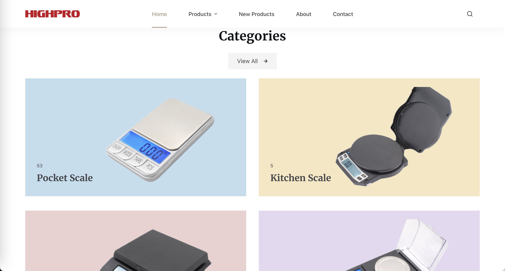
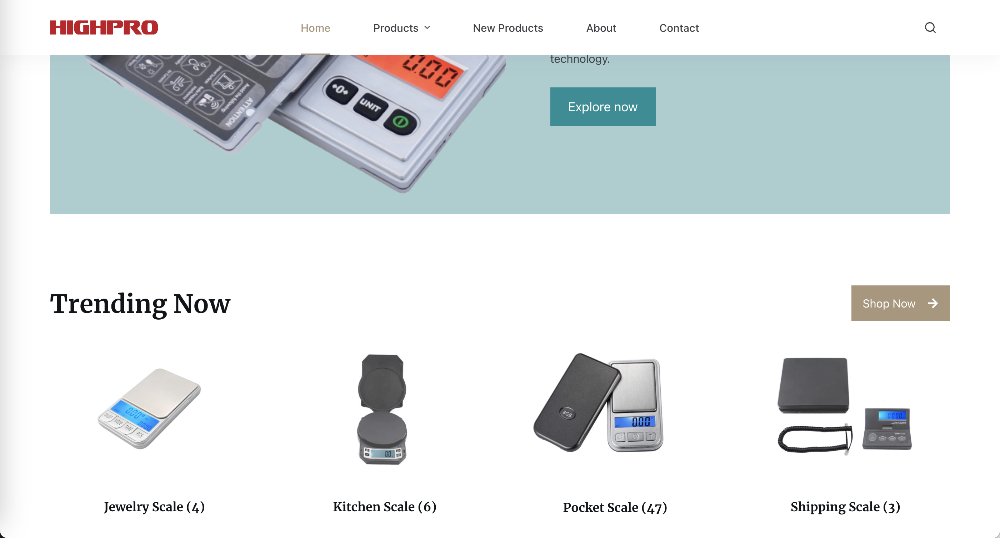
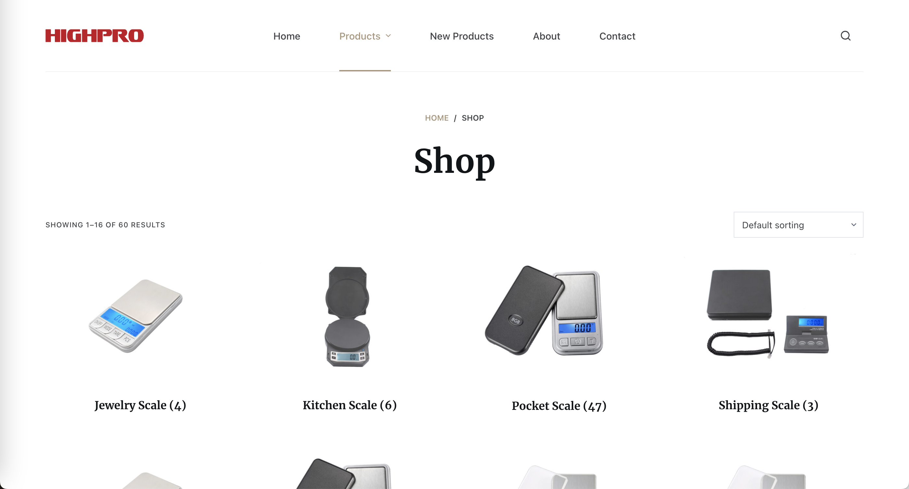
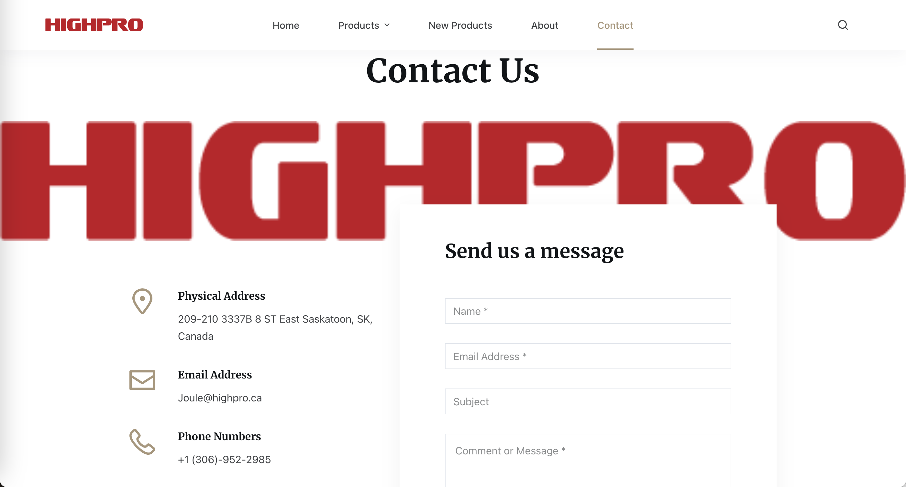

# wordpress-electronic-scale-shop
# WordPress Electronic Scale Store

This repository showcases a fully functional electronic scale store built using WordPress.

## Features

- Browse a variety of electronic scales.
- Explore new products and view detailed images.
- Navigate through different pages:
  - Main Page
  - Product Page
  - New Product Page
  - About Us
  - Contact Us

## Screenshots

*Caption: Brief description of the screenshot.*

*Caption: Brief description of the screenshot.*

*Caption: Brief description of the screenshot.*

*Caption: Brief description of the screenshot.*

*Caption: Brief description of the screenshot.*

## Live Demo

Explore the live WordPress Electronic Scale Store [here]([insert-link-to-live-website](https://highpro.ca/)).

## How to Use

1. **Main Page:** Navigate to the main page to get an overview of available products.
2. **Product Page:** Explore detailed information and images for each electronic scale.
3. **New Product Page:** Discover the latest additions to the store.
4. **About Us:** Learn more about our electronic scale store and our mission.
5. **Contact Us:** Reach out to us with any questions or inquiries.

## Contributing

We welcome contributions! If you find any issues or have suggestions for improvement, feel free to [open an issue](link-to-issue-page) or submit a pull request.

## License

This project is licensed under the [MIT License](link-to-license-file).

